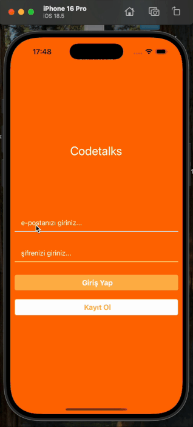

# CodeTalk 📱💬

CodeTalk is a real-time chat application developed with React Native and using the **Firebase** infrastructure. Once logged in, users can create rooms, send messages to rooms, and instantly view other users' posts.

## Preview

## 🚀 Features

- User registration and login with **Firebase Authentication**
- Instant messaging with **Realtime Database**
- User-friendly warning and error notifications with **react-native-flash-message**
- Creating rooms
- Sending messages by entering rooms
- Instant message synchronization between different users
- Secure logout with Firebase
- Modern and simple user interface

## 📱 Screen Flow

1. **Login / Signup** screen

- User can log in or create a new account.

2. **Room List**

- User can create new rooms or join existing rooms.

3. **Messaging Screen**

- All users in the room can send and receive instant messages.

4. **Logout**

- The user can log out at any time.

## 🛠 Technologies Used

- **React Native** (0.80.2)
- **Firebase Authentication** – user authentication
- **Firebase Realtime Database** – real-time data synchronization
- **React Navigation** – page transitions
- **Formik** – form management
- **react-native-flash-message** – alerts and notifications
- **react-native-modal** – custom modal windows
- **date-fns** – date formatting
- **react-native-vector-icons** – icon library
