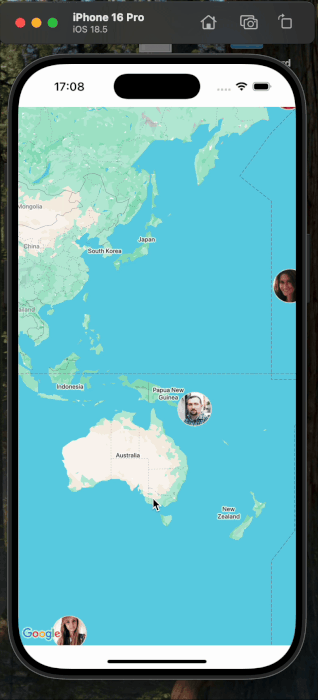

# 📍 Map App

**Map App** is a React Native application that displays a Google Map with markers representing random users fetched from the [Random User API](https://randomuser.me).  
When a marker is tapped, a modal appears showing detailed information about the selected user.

---

## 📷 Screenshots

---

## 🚀 Features

- 🗺 **Google Maps Integration** – Displays an interactive map using **react-native-maps**.
- 👤 **Random User API Integration** – Fetches user data from `https://randomuser.me` using **Axios**.
- 📍 **Custom Markers** – Shows user profile pictures directly on the map as markers.
- 💬 **Modal User Info** – Clicking on a marker opens a modal with detailed user information.
- ⚙ **Environment Variables Support** – Uses **react-native-config** for secure API keys or configuration variables.
- 🔔 **Push Notifications Ready** – Integrated with **OneSignal** for sending and receiving notifications.

---

## 🛠 Technologies

- **React Native** – Mobile app development framework.
- **React** – JavaScript library for building user interfaces.
- **Axios** – HTTP client for making API requests.
- **react-native-maps** – Google Maps / Apple Maps integration.
- **react-native-modal** – Customizable modal component for user information display.
- **react-native-config** – Manages API keys and environment variables.
- **react-native-onesignal** – Push notifications service integration.
- **@react-native/new-app-screen** – Default starter components from a new React Native project.
