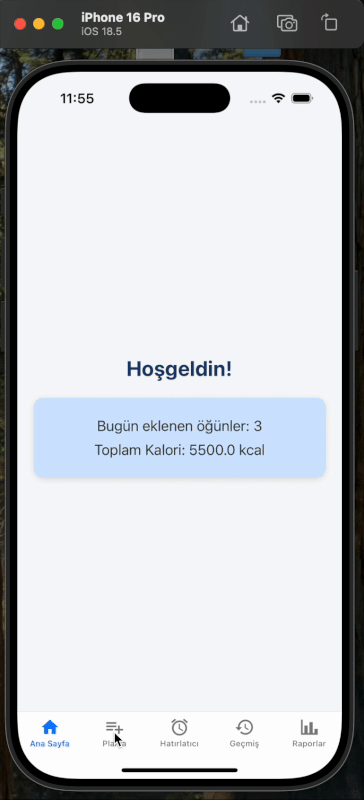

# Diyetim App

**Diyetim App** is a modern mobile application designed to help users manage their eating habits, create personalized diet plans, and analyze their nutrition history.

## Preview

<p align="center">
  
</p>

## Features

- **Custom Diet Plans:** Easily create, update, and delete personalized diet programs and meal menus.
- **Meal Reminders:** Add, edit, or remove reminders with custom labels and times. Notifications are sent when it's time to eat.
- **History & Reports:** View your meal history, track your most consumed foods, and see summarized reports with total/average nutrition values.
- **Nutritional Analysis:** Log calories, proteins, carbs, and fats for each meal and analyze your diet effectively.

## Tech Stack

- **React Native (v0.81.0)** – Core framework
- **React (v19.1.0)** – UI library
- **Redux Toolkit** – State management
- **React Redux** – Binding Redux with React
- **Redux Persist** – Persistent state storage
- **React Navigation (v7)** – Navigation system
- **AsyncStorage** – Local storage
- **Notifee** – Advanced push notifications
- **React Native Push Notification** – Cross-platform notifications
- **React Native Vector Icons** – Icon support
- **React Native Screens & Safe Area Context** – Improved navigation & layout
- **UUID / React Native UUID** – Unique ID generation

## Project Structure

```
src/
  components/      # React Native bileşenleri
  screens/         # Ekranlar
  store/           # Redux store ve slice'lar
  utils/           # Yardımcı fonksiyonlar
```

## Installation

1. **Clone the Repository:**
   ```bash
   git clone <repo-url>
   cd 12-diyetim-app
   ```
2. **Install Dependencies:**
   ```bash
   yarn install
   # veya
   npm install
   ```
3. **Install Pods for iOS:**
   ```bash
   cd ios
   pod install
   cd ..
   ```
4. **Run the App:**
   - Android: `yarn android` veya `npm run android`
   - iOS: `yarn ios` veya `npm run ios`
