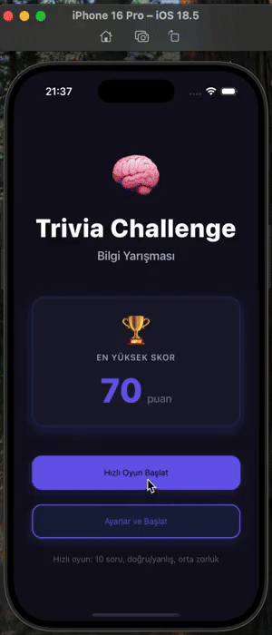

# 🧩 Trivia Challenge App

**Trivia Challenge** is a question-and-answer quiz app built with **React Native**.  
It allows users to test their knowledge across different categories, difficulties, and question types — all in an interactive and timed game format.

---

## Requirements Implemented

- The home screen displays the **highest score** and a **Start Game** button.
- By default, a game starts with **10 True/False questions**.
- Before starting, the user can open **Settings** to customize:
  - Difficulty level (Easy, Medium, Hard)
  - Question type (True/False or Multiple Choice)
  - Question category (Sports, History, Science, etc.)
- Each question has a **12-second timer**.
  - When time runs out, the question is marked as incorrect and the next one appears automatically.
- After completing all questions:
  - The app shows the **final score**, number of correct and incorrect answers.
  - The **highest score** is saved and displayed when the user returns.

---

## ⚙️ Features

- 🏠 Home screen with highest score tracking
- ⚙️ Settings screen for game customization
- 🧠 10-question quiz gameplay with a 12-second timer per question
- ✅ Result screen showing detailed performance stats
- 💾 Firebase integration for storing and retrieving the highest score
- 🔄 Smooth screen transitions using React Navigation
- 🎨 Simple, clean, and responsive UI

---

## 🛠️ Tech Stack

- **React Native**
- **React Navigation**
- **Firebase (Realtime Database / Firestore)**
- **Open Trivia API** → [https://opentdb.com](https://opentdb.com)
- **Animated API (React Native Animations)**
- **Safe Area Context**
