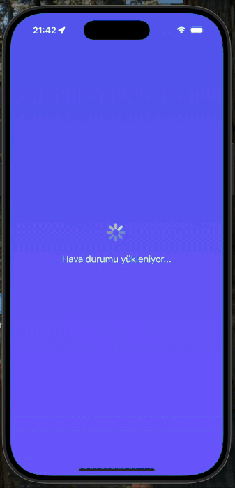

# 🌤️ Weather App

Weather App is a real-time weather forecast application built with React Native. It allows users to check weather conditions for any city worldwide, track their current location's weather, and explore different cities — all in an elegant and dynamic interface.



## Requirements Implemented

- The home screen displays current location's weather with detailed information.
- By default, the app automatically detects user's GPS location and shows weather data.
- Users can search for any city worldwide using the search bar:
  - Real-time city search with API integration
  - Support for Turkish characters (İstanbul, Ankara, İzmir)
  - International cities (London, Paris, New York)
- Dynamic background gradient changes based on weather conditions:
  - Clear sky → Orange-Pink gradient
  - Cloudy → Gray tones
  - Rain → Navy blue shades
  - Snow → White-Gray gradient
- Detailed weather information displayed:
  - Current temperature and "feels like" temperature
  - Humidity percentage
  - Atmospheric pressure (hPa)
  - Wind speed (km/h)
  - Visibility distance (km)
- After searching or refreshing:
  - The app shows city and district information
  - Weather icon updates based on conditions
  - All data refreshes in real-time
- Pull-to-refresh feature loads a random Turkish city for exploration.

## ⚙️ Features

- 🏠 Home screen with automatic location detection
- 🔍 Real-time city search with worldwide coverage
- 🌡️ Detailed weather information (temperature, humidity, pressure, wind, visibility)
- 📍 Reverse geocoding for city and district names
- 🎨 Dynamic gradient backgrounds that change based on weather conditions
- 🔄 Pull-to-refresh to explore random cities
- 💾 Clean architecture with separate services and components
- 🌈 Modern glassmorphism UI design
- 📱 Smooth animations and transitions
- 🌍 Turkish language support

## 🛠️ Tech Stack

- **React Native** (0.82.0)
- **React Navigation** (for screen management)
- **OpenWeatherMap API** → https://openweathermap.org/api
- **BigDataCloud API** (Reverse Geocoding)
- **@react-native-community/geolocation** (GPS services)
- **Axios** (HTTP client)
- **React Native Linear Gradient** (Dynamic backgrounds)
- **Date-fns** (Date formatting with Turkish locale)
- **React Native Config** (Environment variables)
- **Safe Area Context**

### API Key Setup

1. Go to [OpenWeatherMap](https://openweathermap.org/api)
2. Create a free account
3. Get your API key from the dashboard
4. Add it to `.env` file:

```env
WEATHER_API_KEY=your_api_key_here
WEATHER_API_URL=https://api.openweathermap.org/data/2.5
GEOCODING_API_URL=https://api.bigdatacloud.net/data/reverse-geocode-client
```

### Platform Setup

**Android:** Add permissions to `android/app/src/main/AndroidManifest.xml`

```xml
<uses-permission android:name="android.permission.INTERNET" />
<uses-permission android:name="android.permission.ACCESS_FINE_LOCATION" />
<uses-permission android:name="android.permission.ACCESS_COARSE_LOCATION" />
```

**iOS:** Add permissions to `ios/WeatherApp/Info.plist`

```xml
<key>NSLocationWhenInUseUsageDescription</key>
<string>Weather app needs your location to show local weather.</string>
```

## 🎨 Design Features

### Dynamic Gradient System

The app uses weather-based gradient backgrounds:

| Weather    | Gradient Colors     | Effect                |
| ---------- | ------------------- | --------------------- |
| ☀️ Clear   | `#FFB347 → #FF7E5F` | Vibrant orange sunset |
| ☁️ Cloudy  | `#6C7A89 → #95A5A6` | Soft gray clouds      |
| 🌧️ Rain    | `#3A6073 → #3A7BD5` | Deep ocean blue       |
| ❄️ Snow    | `#E0EAFC → #CFDEF3` | Soft winter white     |
| ⛈️ Storm   | `#283E51 → #485563` | Dark stormy sky       |
| 🌫️ Mist    | `#B4B9BE → #D3D8DC` | Light foggy gray      |
| 🌍 Default | `#5A5FF0 → #7A60FF` | Purple gradient       |
