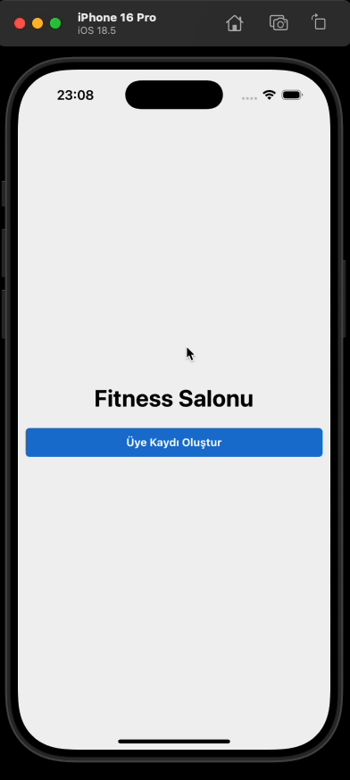

# 5-Auth-App

A modern React Native application demonstrating user authentication flows.

## Demo

Below is a gif showing the main flow of the app:

## Features

- Login and registration screens
- Form validation
- Basic navigation
- Clean and understandable code structure

## Project Structure

- `src/components/` — Shared components
- `src/pages/` — Page components (Login, Register, Result, etc.)
- `src/Router.js` — Navigation logic

## Technologies Used

- React Native
- React Navigation
- Formik (for form management)
- (Add any other libraries if used)
